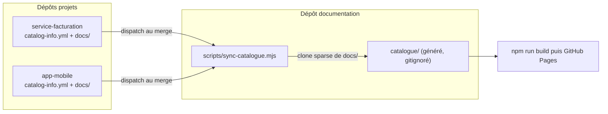

Besoin du jour : une section **Catalogue** qui recense les dépôts Git (apps, services, librairies)
et qui héberge une **copie de leur documentation**, pour avoir une porte d'entrée unique plutôt
qu'une chasse au dépôt.

Cette note pose le raisonnement et tranche sur une cible. Rien n'est implémenté encore.

{/* truncate */}

## Le workflow visé

Le scénario à couvrir, tel qu'il se présentera en vrai :

1. Je crée un nouveau service.
2. Je le documente **dans son dépôt**, à côté du code — c'est le principe Docs as Code.
3. Cette documentation doit suivre un **template commun**, sinon chaque projet invente sa
   structure et le catalogue devient illisible.
4. Le service apparaît dans le catalogue central, avec sa doc consultable et à jour.

Les points 3 et 4 sont les deux vrais sujets : **uniformiser**, puis **agréger**.

## Les deux décisions structurantes

### Où vit la source de vérité ?

Dans le dépôt du projet. Une doc qui vit ailleurs que le code qu'elle décrit se périme, parce
qu'on ne pense jamais à la mettre à jour depuis un autre dépôt dans la même Pull Request.
Corollaire direct : **la copie centrale est un artefact généré, jamais éditée à la main**.

C'est la règle qui rend tout le reste maintenable. Si on s'autorise à corriger une page côté
catalogue, on crée deux vérités et la synchronisation devient un conflit permanent.

### Comment la copie arrive-t-elle ?

| Mécanisme | Ce que ça donne | Verdict |
|---|---|---|
| Copier-coller manuel | Zéro outillage, zéro fraîcheur | Périmé dès la 2e semaine |
| Sous-modules Git | Versionnement explicite, mais HEAD détachée, pointeurs oubliés, tout le code cloné pour quelques fichiers `.md` | Coût d'usage trop élevé |
| `git subtree` | Le contenu est réellement dans le dépôt, clone simple | Historique pollué, `pull` conflictuel |
| **Push** depuis le projet vers le dépôt doc | Le projet publie sa doc lui-même | Demande un jeton en écriture dans N dépôts |
| **Pull** au build par le dépôt doc | Un seul endroit à maintenir, projets non modifiés | Dépend des dépôts distants au moment du build |

Retenu : **pull au build**, avec un déclencheur côté projet.

Le projet ne pousse pas de contenu, il envoie juste un signal (`repository_dispatch`) au dépôt de
documentation quand sa doc change sur `main`. Le dépôt doc resynchronise et republie. On garde un
seul script de synchronisation à maintenir, aucun jeton en écriture distribué dans les projets, et
une fraîcheur événementielle plutôt qu'un cron aveugle.



## Le contrat : un descripteur par projet

Chaque dépôt expose un fichier `catalog-info.yml` à sa racine. L'idée est empruntée à
[Backstage](https://backstage.io/), dont le catalogue repose sur ce type de descripteur, sans en
adopter la plateforme — bien trop lourde pour le besoin.

```yaml title="catalog-info.yml"
nom: Service Facturation
slug: service-facturation
type: service            # service | application | librairie | infrastructure
equipe: plateforme
statut: actif            # actif | maintenance | archive
publication: interne     # interne | publique
stack: [Node.js, PostgreSQL, Docker]
depot: https://github.com/exemple-org/service-facturation
docs: docs/              # dossier à synchroniser
```

Ce fichier porte trois rôles d'un coup : il **déclare** le projet au catalogue, il **décrit** ses
métadonnées pour la page d'inventaire, et il **autorise** la publication de sa documentation.

:::danger Le champ `publication` n'est pas décoratif

Le site est publié sur GitHub Pages **public**. Synchroniser aveuglément la doc de dépôts privés
la rendrait publique. Règle de sécurité par défaut : **sans `publication: publique`, le projet est
listé dans l'inventaire mais sa doc n'est pas copiée** — seul le lien vers le dépôt apparaît. Le
choix de publier est explicite, par projet, et il appartient au projet.

:::

## Le template de documentation projet

C'est la pièce qui manque aujourd'hui, et celle qui conditionne la lisibilité du catalogue.

Bonne nouvelle : le modèle existe déjà sur ce site. Les 5 familles Docs as Code s'appliquent
telles quelles à l'échelle d'un projet, il suffit de les transposer :

```text
mon-service/
├── catalog-info.yml
└── docs/
    ├── index.md          # Service Overview : à quoi ça sert, qui le maintient  -> Cartographie
    ├── architecture.md   # schéma, composants, choix techniques                 -> Architecture
    ├── runbooks/         # déploiement, restauration, incidents récurrents      -> Procédures
    ├── conventions.md    # spécificités du projet                               -> Référentiel
    └── decisions/        # ADR                                                  -> Historique
```

Même modèle, deux échelles : le site central pour le transverse, `docs/` pour le projet. Rien de
nouveau à apprendre, et la fusion des deux dans une même barre latérale reste cohérente.

Distribution du template : un dossier `templates/projet-docs/` dans ce dépôt, copié à la création
d'un projet. Un dépôt *template* GitHub serait plus élégant à terme, mais un `cp -r` documenté
suffit largement pour commencer.

## Mécanique côté Docusaurus

Quatre points concrets à câbler.

**Une instance de plugin docs dédiée**, et une seule pour tout le catalogue — surtout pas une par
projet, sinon la configuration grossit à chaque nouveau service :

```ts title="docusaurus.config.ts"
plugins: [
  [
    '@docusaurus/plugin-content-docs',
    {
      id: 'catalogue',
      path: 'catalogue',
      routeBasePath: 'catalogue',
      sidebarPath: './sidebarsCatalogue.ts',
      editUrl: ({docPath}) => urlAmont(docPath),
    },
  ],
],
```

**Les barres latérales restent autogénérées** depuis l'arborescence : chaque projet synchronisé
devient une catégorie, sans configuration supplémentaire.

**Les liens « Modifier cette page » pointent vers le dépôt d'origine**, via la fonction `editUrl`
ci-dessus. C'est ce qui matérialise la règle « la copie ne s'édite pas ici » : le lecteur qui veut
corriger atterrit dans le bon dépôt.

**Le script de synchronisation ne récupère que les docs**, pas le code :

```bash
git clone --depth 1 --filter=blob:none --sparse "$depot" "$tmp"
git -C "$tmp" sparse-checkout set docs
rsync -a --delete "$tmp/docs/" "catalogue/$slug/"
```

Le dossier `catalogue/` est **généré et gitignoré**. Un script `npm run catalogue:sync` le
reconstitue en local, la CI le reconstruit avant `npm run build`.

## Les pièges repérés d'avance

**Du Markdown étranger ne compile pas forcément en MDX.** Ce site l'a déjà prouvé : le build a
cassé deux fois en une journée, sur un simple lien automatique entre chevrons et sur un
commentaire HTML `truncate`. Une doc écrite ailleurs, sans connaissance de MDX, cassera le build
central. Parade : le script de sync injecte `format: md` dans le front matter des fichiers
importés, pour qu'ils soient interprétés en CommonMark. L'option globale `markdown.format` réglée
sur `detect` ferait la même chose, mais changerait aussi l'interprétation des pages existantes —
trop large.

**Un lien cassé chez un tiers casse tout le site.** La configuration est en `onBrokenLinks` à
`throw`. Une doc projet qui référence `../../README.md` fera échouer le build central. Deux
parades complémentaires : que chaque projet valide sa doc dans **sa propre CI** (le template
fournit le workflow), et que le script de sync signale les liens sortants plutôt que de les
laisser filer jusqu'au build.

**La fraîcheur est invisible.** Une copie ne dit pas qu'elle est périmée. Le script doit écrire la
date de synchronisation et le SHA source en bandeau dans chaque page importée.

**Les dépôts privés demandent un jeton.** Un PAT à portée fine ou une GitHub App, en lecture
seule, stocké côté dépôt documentation uniquement.

## Plan par étapes

| Étape | Contenu | Effort | Ce que ça apporte |
|---|---|---|---|
| 1 | Inventaire statique : registre tenu à la main, page `/catalogue`, liens vers les dépôts. Aucune copie. | ~1 h | Savoir ce qui existe |
| 2 | Template `templates/projet-docs/` et workflow de validation à copier dans les projets | ~2 h | Uniformité dès le prochain projet |
| 3 | Script de sync, instance docs dédiée, CI déclenchée par dispatch | ~1 j | La copie vit toute seule |
| 4 | Auto-découverte via `gh repo list` et présence de `catalog-info.yml` : le registre central disparaît | plus tard | Plus rien à maintenir à la main |

L'ordre compte : l'étape 1 a de la valeur même si les suivantes n'arrivent jamais, et l'étape 2
avant l'étape 3 évite de synchroniser du désordre.

## Décisions à trancher avant d'implémenter

- **Le site reste-t-il public ?** Si oui, le champ `publication` est un garde-fou obligatoire. Si
  la doc doit être interne, il faut un autre hébergement que GitHub Pages public.
- **Sync au build ou contenu commité ?** Le pull au build suppose que la CI a accès aux dépôts.
  Commiter le contenu synchronisé rendrait le dépôt autonome, au prix d'un bruit d'historique.
- **Page catalogue générée ou écrite à la main ?** Un tableau Markdown généré par le script suffit
  au début ; une page React avec filtres ne se justifie qu'au-delà d'une dizaine de projets.

Prochaine session : l'étape 1, pour mettre la structure en place et voir ce que ça donne avec deux
ou trois dépôts réels.
