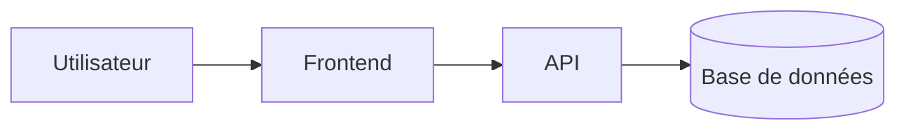

# 🏗️ [Nom du projet / composant]

> Modèle à dupliquer pour documenter l'architecture d'un projet ou d'un composant.

- **Date** : AAAA-MM-JJ
- **Statut** : `brouillon` | `validé` | `obsolète`
- **Périmètre** : à quel système / service ce schéma se rapporte-t-il ?

## Contexte

Pourquoi ce système existe-t-il ? Quel problème résout-il ?

## Vue d'ensemble (diagramme)

## Composants

| Composant | Rôle | Technologie |
|---|---|---|
| Frontend | ... | ... |
| API | ... | ... |
| Base de données | ... | ... |

## Choix techniques

- **Choix n°1** — justification.
- **Choix n°2** — justification.

## Limites connues

- Limite ou dette technique identifiée.

## Voir aussi

- [Historique](/docs/historique/) pour les décisions formalisées (ADR) liées à cette architecture.
